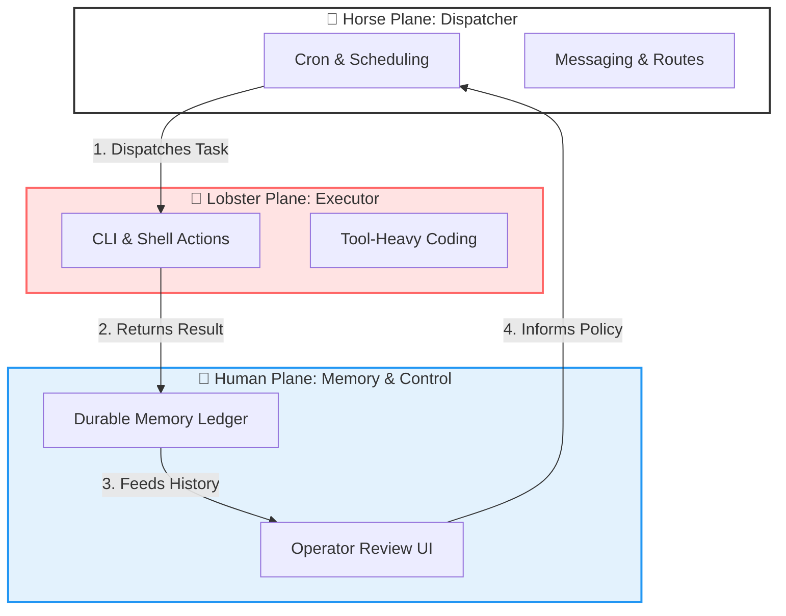

# RanchMind

> **Lobster + Horse + Human.**  
> One writes code, one moves work, one remembers why it matters.

RanchMind is a **closed-loop agent runtime** designed to integrate execution, scheduling, and memory into a unified control plane.

It now includes a **harness-driven runtime** for long-running work:

- a **planner contract** written before execution starts
- a **generator/executor** that performs the work
- an **evaluator** that judges the result against explicit acceptance checks
- durable handoff artifacts so the next run can inspect what happened instead of starting blind

---

## 🎨 Visual Concept

Imagine a **Retro-futurist Operations Barn** at night:
- 🦞 **The Lobster (Red):** The execution specialist, hunched over terminal screens, writing code and capturing receipts.
- 🐎 **The Horse (White):** The tireless dispatcher, managing a wall of clocks, message routes, and task queues.
- 👤 **The Human (Operator):** The calm center, standing before a glowing memory graph and dashboard.
- ⚡ **The Loop:** Threads of light connect all three into a continuous, learning circuit.

---

## 🏗️ Architecture: The Three-Plane Model

RanchMind treats Execution, Scheduling, and Memory as first-class, interconnected planes rather than disconnected tools.



---

## 🧠 Problems Solved

RanchMind addresses the "missing link" in current AI agent architectures:

1.  **Blind Scheduling (The "Memoryless" Problem):**
    *   *Problem:* Standard cron jobs run tasks in isolation, unaware of previous failures or results.
    *   *Solution:* The **Horse Plane** uses **Human Plane** memory to adjust scheduling logic (e.g., "Don't run task B if task A failed and memory says the environment is unstable").

2.  **Unchecked Autonomy (The "Black Box" Problem):**
    *   *Problem:* Coding agents (like Lobster) can be hard to trust when running background tasks.
    *   *Solution:* The **Human Plane** acts as a central operator-facing control surface for review and approval, ensuring safety policies are enforced.

3.  **Passive Data Silos (The "Forgotten Context" Problem):**
    *   *Problem:* Most logs are passive artifacts that disappear after execution.
    *   *Solution:* Every output from the **Lobster Plane** is captured as a "Durable Receipt" in the memory ledger, becoming active context for future tasks.

---

## 🚀 Why RanchMind?

Instead of choosing between an agent farm, a cron bot, or a memory store, RanchMind turns them into a single product.

- **Execution is pluggable:** Use OpenClaw-style CLI power.
- **Scheduling is pluggable:** Use Hermes-style messaging and dispatch.
- **Memory is pluggable:** Use OpenHuman-style local-first context.

---

## 🛠️ Local MVP: Non-Trading Day Factor Training

This repository includes a working MVP for the **Windows KD training workflow**.

### Commands

```bash
# Check status of the system
node ./scripts/ranchmind.mjs status

# Compute the latest memory-fed scheduling policy snapshot
node ./scripts/ranchmind.mjs evaluate-scheduling

# Run the bounded autonomy/improvement loop
node ./scripts/ranchmind.mjs run-autonomy-loop

# Run a manual harnessed training task
node ./scripts/ranchmind.mjs run-training --date 2026-05-17 --source ranchmind.manual

# Register the task in Windows Task Scheduler
node ./scripts/ranchmind.mjs register-training --disable-legacy

# Inspect and repair the Feishu-facing runtime
node ./scripts/ranchmind.mjs ensure-feishu-runtime

# Register the Feishu watchdog
node ./scripts/ranchmind.mjs register-feishu-watchdog
```

### Harness runtime

For the training lane, `run-training` is now a full harness, not a thin wrapper:

1. **Plan / contract**
   - writes `contract.json`
   - freezes retry policy, acceptance checks, command, args, and scheduler context
2. **Execute**
   - runs the configured training adapter
   - records each attempt into `attempts/attempt-NN.json`
3. **Evaluate**
   - separately checks outcome status and required artifacts
   - retries only execution failures
   - blocks metric/policy failures for operator review instead of looping blindly
4. **Finalize**
   - writes `evaluation.json`, `run-state.json`, and `final-receipt.json`
   - updates the legacy `training-latest.json` / `.md` memory files for backward compatibility

### Platform Adapters

| Platform | Training Adapter (Lobster) | Scheduler Adapter (Horse) |
| --- | --- | --- |
| **Windows** | PowerShell KD script | Windows Scheduled Task |
| **macOS** | CLI (Configurable) | cron |
| **Linux** | CLI (Configurable) | cron |

State is stored locally under `state/memory/`, `state/receipts/`, and `state/runs/`.

### Durable run artifacts

Each harness run creates a dedicated directory:

```text
state/
  runs/
    training-<timestamp>/
      contract.json
      run-state.json
      evaluation.json
      final-receipt.json
      attempts/
        attempt-01.json
        attempt-02.json
```

This is the core change inspired by Anthropic's harness design: RanchMind no longer assumes one fire-and-forget execution is enough. It preserves the contract, each attempt, and the evaluator decision as structured artifacts.

### Reliability model

- **Automatic retries** are only for execution failures such as process errors, malformed output, or missing artifacts.
- **Accepted no-op outcomes** like trading-day skips are treated as successful runs, not failures.
- **Quality/policy failures** become `blocked` and require operator review; RanchMind does not auto-loop forever on weak metrics.
- **Scheduled Windows runs** now execute the Node harness entrypoint directly rather than bypassing it with a raw PowerShell wrapper.

## 🛰️ Feishu runtime watchdog

RanchMind now adds a Feishu watchdog inspired by the durable launcher patterns already proven in Hermes/OpenClaw:

- snapshots source Codex auth and Hermes runtime auth
- compares token fingerprints without storing raw tokens
- reads Hermes gateway state and recent gateway log failures
- distinguishes **gateway down** from **gateway alive but stuck**
- syncs runtime auth only when the source token is healthy
- **blocks** instead of blind-restarting when the source token is the same one the server already rejected
- restarts the gateway by killing the stuck gateway PID so the existing Hermes launcher can re-run its own sync-and-start loop

### Feishu watchdog state

```text
state/
  memory/
    feishu-runtime-latest.json
    feishu-runtime-latest.md
    feishu-runtime-history.jsonl
```

This means RanchMind can now tell the difference between:

- **healthy**: gateway running and not accumulating auth failures
- **recovering**: RanchMind synced auth and triggered a launcher-driven restart
- **degraded**: RanchMind found a runtime problem but could not repair it automatically
- **blocked**: the local source token itself needs re-authentication, so restarting Hermes would just loop

## 🧭 Memory-fed scheduling policy

RanchMind now computes a **report-only scheduling policy** for the training lane so Human-plane memory can influence Horse-plane visibility without blindly hard-blocking execution.

- reads `training-latest-run.json` to detect whether the most recent harness run ended in `failed` or `blocked`
- scans recent `training-history.jsonl` to find the last successful `outcome.status = ok` run
- reads `feishu-runtime-latest.json` as an **advisory** signal only
- treats stale or missing Feishu snapshots as warnings instead of pretending they are healthy
- writes a durable policy snapshot for operators and future automation

### Scheduling policy state

```text
state/
  memory/
    scheduling-policy-latest.json
    scheduling-policy-latest.md
    scheduling-policy-history.jsonl
```

The current v0 policy is intentionally **observe-only**:

- **allowed**: no recent harness blocker was detected
- **degraded**: the latest training harness run failed or blocked and should be reviewed
- **unknown**: RanchMind has not yet seen enough durable run history to judge confidently

Feishu notification health is surfaced as a warning because a broken chat channel should not silently suppress a valid local KD training run.

## ♻️ Autonomy improvement loop

RanchMind now has a bounded **autonomy loop** that turns durable history into a ranked improvement plan instead of trying to self-modify blindly.

- computes a baseline from recent `training-history.jsonl` and `feishu-runtime-history.jsonl`
- measures how often the lane ran without blocking, and how many successful `ok` training runs exist
- separates **operational** candidates from **quality** candidates
- keeps the current mode as `recommend_only` so the system does not weaken its own quality gates
- writes durable loop artifacts for the next iteration instead of starting from scratch

### Autonomy loop state

```text
state/
  memory/
    autonomy-loop-latest.json
    autonomy-loop-latest.md
    autonomy-loop-history.jsonl
```

Each loop run also writes per-run artifacts under `state/runs/autonomy-loop-<timestamp>/`:

```text
autonomy-baseline.json
improvement-plan.json
evaluation.json
result.json
```

The current v0 loop intentionally **does not auto-apply arbitrary code or threshold changes**. It is a harnessed discovery/analysis/evaluation layer that prepares the next safe RanchMind change.

---

## 📂 Repository Structure

```text
ranchmind/
  apps/
    human-plane/     # Operator UI & Control Plane
  packages/
    horse-plane/     # Scheduling & Dispatch logic
    lobster-plane/   # Execution & CLI adapters
    memory-plane/    # Durable storage & context
  scripts/
    ranchmind.mjs    # Unified CLI entry point
  ranchmind.config.json # Adapter configurations
```

---

## 🎯 Initial Roadmap

- [x] Harness-style run ledger for the training lane.
- [x] Memory-fed dynamic scheduling rules.
- [x] Bounded autonomy improvement loop.
- [ ] Operator review UI for scheduled task results.
- [ ] Pluggable channel delivery (Slack/Feishu/Telegram).

---

## 📜 License
MIT

