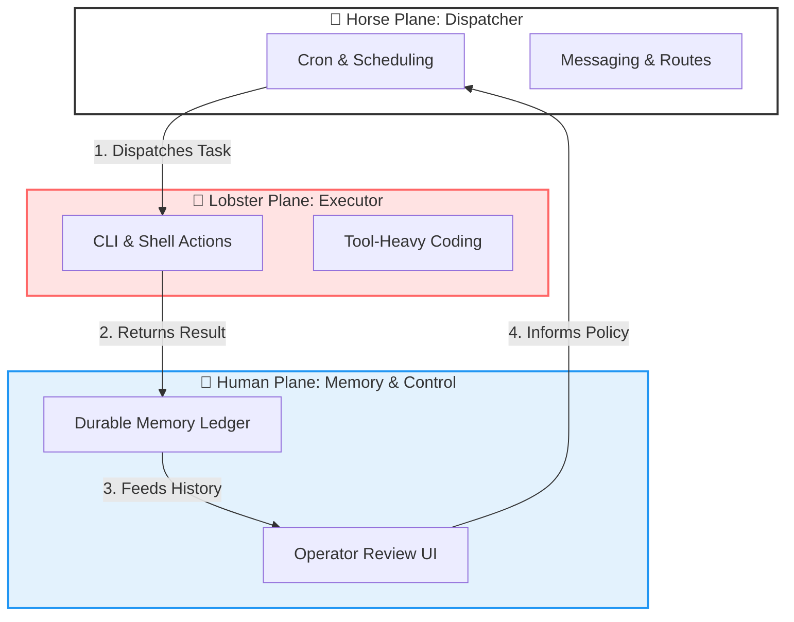

# RanchMind

> **Lobster + Horse + Human.**  
> One writes code, one moves work, one remembers why it matters.

RanchMind is a **closed-loop agent runtime** designed to integrate execution, scheduling, and memory into a unified control plane.

---

## 🎨 Visual Concept

Imagine a **Retro-futurist Operations Barn** at night:
- 🦞 **The Lobster (Red):** The execution specialist, hunched over terminal screens, writing code and capturing receipts.
- 🐎 **The Horse (White):** The tireless dispatcher, managing a wall of clocks, message routes, and task queues.
- 👤 **The Human (Operator):** The calm center, standing before a glowing memory graph and dashboard.
- ⚡ **The Loop:** Threads of light connect all three into a continuous, learning circuit.

---

## 🏗️ Architecture: The Three-Plane Model

RanchMind treats Execution, Scheduling, and Memory as first-class, interconnected planes rather than disconnected tools.



---

## 🧠 Problems Solved

RanchMind addresses the "missing link" in current AI agent architectures:

1.  **Blind Scheduling (The "Memoryless" Problem):**
    *   *Problem:* Standard cron jobs run tasks in isolation, unaware of previous failures or results.
    *   *Solution:* The **Horse Plane** uses **Human Plane** memory to adjust scheduling logic (e.g., "Don't run task B if task A failed and memory says the environment is unstable").

2.  **Unchecked Autonomy (The "Black Box" Problem):**
    *   *Problem:* Coding agents (like Lobster) can be hard to trust when running background tasks.
    *   *Solution:* The **Human Plane** acts as a central operator-facing control surface for review and approval, ensuring safety policies are enforced.

3.  **Passive Data Silos (The "Forgotten Context" Problem):**
    *   *Problem:* Most logs are passive artifacts that disappear after execution.
    *   *Solution:* Every output from the **Lobster Plane** is captured as a "Durable Receipt" in the memory ledger, becoming active context for future tasks.

---

## 🚀 Why RanchMind?

Instead of choosing between an agent farm, a cron bot, or a memory store, RanchMind turns them into a single product.

- **Execution is pluggable:** Use OpenClaw-style CLI power.
- **Scheduling is pluggable:** Use Hermes-style messaging and dispatch.
- **Memory is pluggable:** Use OpenHuman-style local-first context.

---

## 🛠️ Local MVP: Non-Trading Day Factor Training

This repository includes a working MVP for the **Windows KD training workflow**.

### Commands

```bash
# Check status of the system
node ./scripts/ranchmind.mjs status

# Run a manual training task
node ./scripts/ranchmind.mjs run-training --date 2026-05-17 --source ranchmind.manual

# Register the task in Windows Task Scheduler
node ./scripts/ranchmind.mjs register-training --disable-legacy
```

### Platform Adapters

| Platform | Training Adapter (Lobster) | Scheduler Adapter (Horse) |
| --- | --- | --- |
| **Windows** | PowerShell KD script | Windows Scheduled Task |
| **macOS** | CLI (Configurable) | cron |
| **Linux** | CLI (Configurable) | cron |

State is stored locally under `state/memory/` and `state/receipts/`.

---

## 📂 Repository Structure

```text
ranchmind/
  apps/
    human-plane/     # Operator UI & Control Plane
  packages/
    horse-plane/     # Scheduling & Dispatch logic
    lobster-plane/   # Execution & CLI adapters
    memory-plane/    # Durable storage & context
  scripts/
    ranchmind.mjs    # Unified CLI entry point
  ranchmind.config.json # Adapter configurations
```

---

## 🎯 Initial Roadmap

- [ ] Unified run ledger across all three planes.
- [ ] Operator review UI for scheduled task results.
- [ ] Memory-fed dynamic scheduling rules.
- [ ] Pluggable channel delivery (Slack/Feishu/Telegram).

---

## 📜 License
MIT

